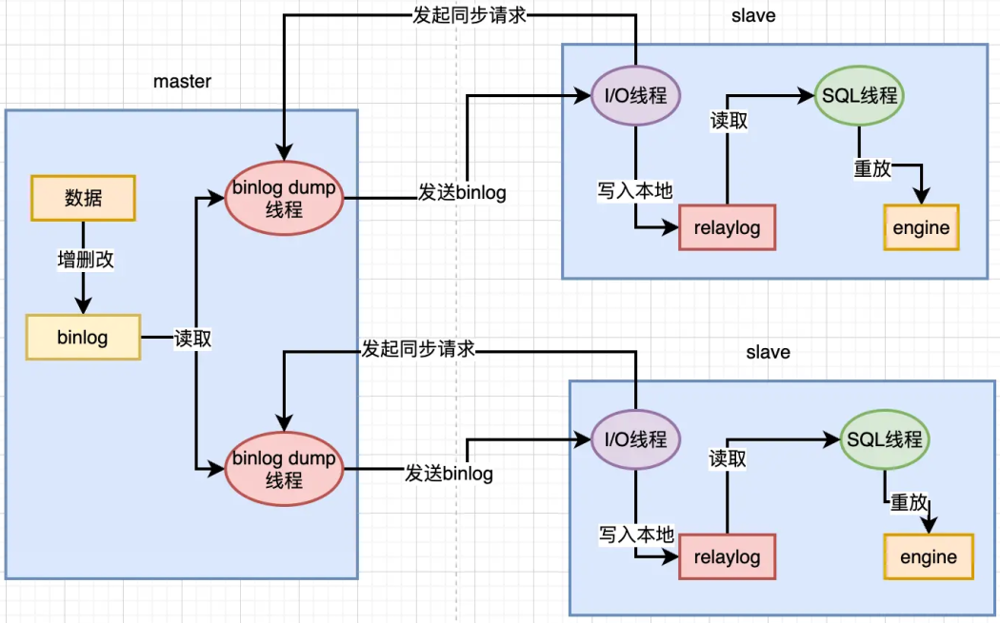

# MySQL主从复制

## 主从复制的简介

在实际的生产中，为了解决 MySQL 的单点故障问题，以及提高 MySQL 的整体服务性能，一般都会采用 **主从复制**。

比如：在复杂的业务系统中，有一句 sql 执行后导致了锁表，并且这条 sql 的的执行时间有比较长，那么此 sql 执行的期间会导致部分服务不可用，这样就会严重影响到用户的体验。

主从复制过程中，服务器一般分为 **主库（master）** 和 **从库（slave）**，常见的场景下，**主库负责写，而从库负责读**。

读写分离的做法能够实现整体服务性能的提高，即使写操作时间比较长，也不影响读操作的进行。

## 主从复制的原理

MySQL 的主从复制的过程是一个 **异步** 的过程，底层是基于 MySQL 数据库自带的 **二进制日志（binary log）** 功能。

> 二进制日志（bin-log）记录了所有的 DDL（数据定义语言）语句和 DML（数据操纵语言）语句，但是不包括数据查询语句。
>
> 此日志对于灾难时的数据恢复起着极其重要的作用，MySQL的主从复制， 就是通过 bin-log 实现的。
>
> 默认MySQL是未开启该日志的。

一台或多台 MySQL 数据库（slave，即从库）从另一台 MySQL 数据库（master，即主库）进行日志的复制，然后解析日志，并应用到自身，最终实现从库的数据和主库的数据保持一致。 

MySQL 主从复制是 MySQL 数据库底层自带的功能，所以无需借助第三方工具就可实现。



MySQL 的主从复制过程中，主要有 3 个线程：**master（binlog dump thread）**、**slave（I/O thread 、SQL thread）**，其中 Master 为 1 条线程，Slave 为 2 条线程。

**master（binlog dump thread）** 主要负责 Master 库中有数据更新的时候，会按照 `binary log` 格式，将更新的事件类型写入到主库的 `binary log` 文件中。

并且，Master 会创建 `log dump` 线程通知 Slave 主库中存在数据更新，这就是为什么主库的  `binary log` 日志一定要开启的原因。

`I/O thread` 线程在 Slave 中创建，该线程用于请求 Master，Master 会返回 `binary log` 的名称以及当前数据更新的位置、 `binary log`  文件位置的副本。

然后，将 `binary log` 保存在 **relay log（中继日志）** 中，中继日志也是记录数据更新的信息。

SQL 线程也是在 Slave 中创建的，当 Slave 检测到中继日志有更新，就会将更新的内容同步到 Slave 数据库中，这样就保证了主从的数据的同步。

以上就是主从复制的过程，当然，主从复制的过程有不同的策略方式进行数据的同步，主要包含以下几种：

- **同步策略**：Master 会等待所有的 Slave 都回应后才会提交，这个主从的同步的性能会严重的影响。
- **半同步策略**：Master 至少会等待一个 Slave 回应后提交。
- **异步策略**：Master 不用等待 Slave 回应就可以提交。
- **延迟策略**：Slave 要落后于 Master 指定的时间。

对于不同的业务需求，有不同的策略方案，但是一般都会采用 **最终一致性**，不会要求 **强一致性**，毕竟强一致性会严重影响性能。

**最终一致性**：

- 不保证在任意时刻任意节点上的同一份数据都是相同的，但是随着时间的迁移，不同节点上的同一份数据总是在向趋同的方向变化
- 最终两个字用得很微妙，因为从写入主库到反映至从库之间的延迟，可能仅仅是几分之一秒，也可能是几个小时

## 主从搭建

### 准备工作

提前准备两台服务器，并且在服务器中安装MySQL，服务器的信息如下：

| 数据库 | IP              | 数据库版本 |
| ------ | --------------- | ---------- |
| Master | 192.168.200.200 | 5.7.25     |
| Slave  | 192.168.200.201 | 5.7.25     |

**并在两台服务器上做如下准备工作：** 

1. 防火墙开放 3306 端口号

   ```sh
   # 防火墙开放3306端口号
   firewall-cmd --zone=public --add-port=3306/tcp --permanent
   # 查看防火墙开放端口列表
   firewall-cmd --zone=public --list-ports 
   ```

2. 将两台数据库服务器上的 MySQL 服务启动起来

   ```sh
   systemctl start mysqld 
   ```

### 主库配置

1. 修改 MySQL 数据库的配置文件 `/etc/my.cnf`

   在文件内容的最下面，增加如下配置：

   ```sh
   # 配置编码为utf8
   character_set_server=utf8mb4
   init_connect='SET NAMES utf8mb4'
   
   # 配置要给Slave同步的数据库
   binlog-do-db=test
   # 不用给Slave同步的数据库，一般是Mysql自带的数据库就不用给Slave同步了
   binlog-ignore-db=mysql
   binlog-ignore-db=information_schema
   binlog-ignore-db=performance_schema
   binlog-ignore-db=sys
   # 自动清理30天前的log文件
   expire_logs_days=30
   # [必须]启用二进制日志
   log-bin=mysql-bin
   # [必须]Master的id，这个要唯一，唯一是值，在主从中唯一
   server-id=3
   ```

2. 重启 MySQL 服务

   ```sh
   systemctl restart mysqld
   ```

3. 创建 **数据同步** 的用户并授权

   登录 MySQL，并执行如下指令，创建用户并授权：

   ```mysql
   GRANT REPLICATION SLAVE ON *.* to 'xiaoming' @'%' identified by 'Root@123456';
   ```

   这句 SQL 的作用是创建一个用户 `xiaoming`，密码为 `Root@123456` ，并且给 xiaoming 用户授予 `REPLICATION SLAVE` 权限。

   常用于建立复制时所需要用到的用户权限，也就是 Slave 必须被 Master 授权为具有该权限的用户，才能通过该用户复制。

   MySQL 密码复杂程度说明：MySQL 5.7 默认密码校验策略等级为 MEDIUM , 该等级要求密码组成为：数字、小写字母、大写字母 、特殊字符、长度至少8位。

4. 登录 MySQL 数据库，查看 Master 的同步状态

   执行下面 SQL，记录下结果中 **File** 和 **Position** 的值，后面配置 Slave 的时候要使用到这两个数据

   ```mysql
   show master status;
   ```

   

   File 记录的是日志文件的名称，Position 是当前日志记录到的位置。

   **上面 SQL 的作用是查看 Master 的状态，执行完此 SQL 后不要再执行任何操作**，否则 File 和 Position 都会发生变化。

### 从库配置

1. 同样需要先修改 MySQL 数据库的配置文件 `/etc/my.cnf`

   在文件内容的最下面，增加如下配置：

   ```sh
   # [必须]配置从服务器的id，这个要唯一，唯一是值，在主从中唯一
   server-id=4
   # 加上以下参数可以避免更新不及时，避免SLAVE重启后导致的主从复制出错。
   read_only=1
   master_info_repository=TABLE
   relay_log_info_repository=TABLE
   ```

2. 重启 MySQL 服务

   ```sh
   systemctl restart mysqld
   ```

3. 登录 MySQL 数据库，设置主库地址及同步位置

   ```mysql
   change master to master_host='192.168.200.200',master_user='xiaoming',master_password='Root@123456',master_log_file='mysql-bin.000001',master_log_pos=154;
   ```

   参数说明： 

   - **master_host**：主库的 IP 地址
   - **master_user**：访问主库进行主从复制的用户名（上面在主库创建的）
   - **master_password**：访问主库进行主从复制的用户名对应的密码
   - **master_log_file**：从哪个日志文件开始同步（上述查询 Master 状态中展示的有）
   - **master_log_pos**：从指定日志文件的哪个位置开始同步（上述查询 Master 状态中展示的有）

4. 查看从数据库的状态

   ```mysql
   show slave status\G;
   ```

   通过状态信息中的 `Slave_IO_running` 和 `Slave_SQL_running` 可以看出主从同步是否就绪，如果这两个参数的值全为 Yes，表示主从同步已经配置完成了。

   `Slave_IO_Running` 也就是 Slave 中的 IO 线程用于请求 Master，`Slave_SQL_Running` 是 SQL 线程，负责将中继日志中更新的内容同步到 Slave 数据库中。

   有时候 `Slave_IO_Running` 会为 No，而 `Slave_SQL_Running` 为Yes，这时候需要检查一下原因。

   首先重启一下 `Slave` 的MySQL服务：`systemctl restart mysqld`，然后执行：

   ```sh
   stop slave;
   start slave;
   ```

   这样就能够使 `Slave_IO_Running` 和 `Slave_SQL_Running` 显示都是 Yes 了。

**MySQL 命令行技巧**： 

- `\G`：在 MySQL 的 SQL 语句后加上 `\G`，表示将查询结果进行按列打印，可以使每个字段打印到单独的行。也就是将查到的数据结构旋转90度变成纵向，这样的显示效果更好，而且方便查询。

### 测试

主从复制的环境已经搭建好了，我们可以通过 Navicat 连接上两台 MySQL 服务器进行测试。

测试时，我们只需要在主库 Master 执行操作，查看从库 Slave 中是否将数据同步过去即可。

1. 在 Master 中创建数据库 itcast，刷新 Slave 查看是否可以同步过去
2. 在 Master 的 itcast 数据库下创建 user 表, 刷新 Slave 查看是否可以同步过去
3. 在 Master 的 user 表中插入一条数据，刷新 Slave 查看是否可以同步过去

## 主从面试题

**MySQL 主从有什么优点？为什么要选择主从？**

- 高性能方面：主从复制通过水平扩展的方式，解决了原来单点故障的问题，并且原来的并发都集中到了一台 MySQL 服务器中，现在将单点负载分散到了多台机器上，实现读写分离，不会因为写操作过长锁表而导致读服务不能进行的问题，提高了服务器的整体性能。
- 可靠性方面：主从在对外提供服务的时候，若是主库挂了，会有通过主从切换，选择其中的一台 Slave 作为 Master；若是 Slave 挂了，还有其它的 Slave 提供读服务，提高了系统的可靠性和稳定性。

**若是主从复制，达到了写性能的瓶颈，该怎么解决呢？**

- 主从模式对于写少读多的场景确实非常大的优势，但是总会有写操作达到瓶颈的时候，导致性能提不上去。
- 这时候可以在设计上进行解决采用分库分表的形式，对于业务数据比较大的数据库可以采用分表，使得数据表的存储的数据量达到一个合理的状态。
- 也可以采用分库，按照业务进行划分，这样对于单点的写，就会分成多点的写，性能方面也就会大大提高。

**主从复制的过程有数据延迟，导致 Slave 被读取到的数据并不是最新数据，怎么办？**

- 主从复制有不同的复制策略，对于不同的场景的适应性也不同，对于数据的实时性要求很高，要求强一致性，可以采用同步复制策略，但是这样就会性能就会大打折扣。

- 若是主从复制采用异步复制，要求数据最终一致性，性能方面也会好很多。只能说，对于数据延迟的解决方案没有最好的方案，就看你的业务场景中哪种方案使比较适合的。
