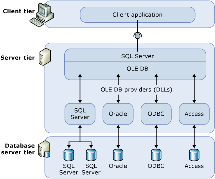

::: tip 什么是数据库
数据库是以一定方式储存在一起、能与多个用户共享、具有尽可能小的冗余度、与应用程序彼此独立的数据集合，可视为电子化的文件柜——存储电子文件的处所，用户可以对文件中的数据进行新增、查询、更新、删除等操作
:::

# 初识MySQL

## 一、服务器端运行原理



- IP地址（Internet Protocol Address）是指互联网协议地址，又译为网际协议地址。他是IP协议提供的一种统一的地址格式，可以为互联网上的每一个网络和每一台主机分配一个逻辑地址，以此来屏蔽物理地址的差异。
- 端口号，就好像是门牌号一样，客户端可以通过IP地址找到对应的服务器端，但是服务器端是有很多端口的，每个应用程序对应一个端口号，通过类似门牌号的端口号，客户端才能真正的访问到该服务器。为了对端口进行区分，将每个端口进行了编号，这就是端口号。
- 端口号的主要作用是表示一台计算机中的特定进程所提供的服务。
  - 网络中的计算机是通过IP地址来代表其身份的，它只能表示某台特定的计算机，但是一台计算机上可以同时提供很多个服务，如数据库服务、FTP服务、Web服务等。
  - 我们就通过端口号来区别相同计算机所提供的这些不同的服务，如常见的端口号21表示的是FTP服务，端口号23表示的是Telnet服务端口号25指的是SMTP服务等。
  - 端口号一般习惯为4位整数，在同一台计算机上端口号不能重复，否则，就会产生端口号冲突这样的意外。

## 二、为什么学习数据库

1、岗位技能需求

2、现在的世界，得数据者得天下

3、存储数据的方法

4、程序、网站中，大量数据如何长久保存

5、**数据库几乎是软件体系中最核心的一个存在**

## 三、什么是数据库

数据库 ( **DataBase** , 简称**DB** )

- Excel 就是一个数据库，便于人类操作

- MySQL 是一个数据库，便于程序操作，用来存储百万以上级别的数据

**概念** : 长期存放在计算机内，有组织，可共享的大量数据的集合，是一个数据 "仓库"

**作用** : 保存，并能安全管理数据（如：增删改查等），减少冗余...

**数据库总览 :**

- 关系型数据库 ( SQL )

  - 关系数据库是建立在关系模型基础上的数据库，借助于集合代数等数学概念和方法来处理数据库中的数据。现实世界中的各种实体以及实体之间的各种联系均用关系模型来表示

  - 关系型数据库是由多张能互相连接的 **二维表** 组成的数据库

  - MySQL , Oracle , SQL Server , SQLite , DB2  ...

  - 关系型数据库通过外键关联来建立表与表之间的关系

- 非关系型数据库 ( NOSQL )

  - Redis , MongoDB  ...

  - 非关系型数据库通常指数据以对象的形式存储在数据库中，而对象之间的关系通过每个对象自身的属性来决定


## 四、数据库排行（2020.2.4）

1. Oracle
2. MySQL
3. Microsoft SQL Server
4. PostgreSQL
5. MongoDB
6. IBM Db2

## 五、什么是DBMS

数据库管理系统 ( **D**ata**B**ase **M**anagement **S**ystem )

数据库管理软件 , 科学组织和存储数据 , 高效地获取和维护数据


为什么要说这个呢?

因为我们要学习的MySQL应该算是一个数据库管理系统

## 六、MySQL简介

**概念 :** 是现在 **流行** 的、 **开源** 的、**免费**的 **关系型** 数据库

**历史 :** 由瑞典 MySQL AB 公司开发，目前属于 Oracle 旗下产品。

**特点 :** 

- 免费 , 开源数据库
- 小巧 , 功能齐全
- 使用便捷
- 可运行于Windows或Linux操作系统
- 可适用于中小型甚至大型网站应用

**官网 :**[ **https://www.mysql.com/**](https://www.mysql.com/)

## 七、下载 MySQL

**这里建议大家使用压缩版,安装快,方便.不复杂.**

**软件下载**

mysql下载地址：https://dev.mysql.com/downloads/mysql/](https://dev.mysql.com/downloads/mysql/)

电脑是64位的就下载使用64位版本的。

**安装过程此文略去。**

## 八、MySQL自带的4个系统数据库

- **information_schema** 这个数据库保存了MySQL服务器上所有数据库的信息。比如数据库的名、数据库的表、访问权限、数据库表的数据类型、数据库索引的信息等等。
- **performance_schema** 主要用于收集数据库服务器性能参数，可用于监控服务在一个较低级别的运行过程中的资源消耗、资源等待等情况。
- **sys** 库中所有的数据源来自于**performance_schema**，目标是把**performance_schema**的复杂度降低，让DBA能更好的阅读这个库里的内容。让DBA更快的了解DB的运行情况。
- **mysql** MySQL的核心数据库，类似于 sql server 中的master表，主要负责存储数据库的用户、权限通知、关键字等MySQL自己需要使用的控制和管理信息。

## 九、连接数据库

打开 MySQL 命令窗口

- 在DOS命令行窗口进入 **安装目录\mysql\bin**
- 可设置环境变量，设置了环境变量，可以在任意目录打开！

**连接数据库语句 :** mysql -h 服务器主机地址 -u 用户名 -p用户密码

::: danger 注意 

-p后面不能加空格，否则会被当做密码的内容，导致登录失败 !

:::

**几个基本的数据库操作命令 :**

```sql
-- 修改密码
update user set password=password('123456')where user='root'; 
-- 刷新数据库
flush privileges; 
-- 显示所有数据库
show databases; 
-- 打开某个数据库
use dbname；
-- 显示数据库mysql中所有的表
show tables; 
-- 显示表mysql数据库中user表的列信息
describe user; 
-- 创建数据库
create database name; 
-- 选择数据库
use databasename; 
-- 退出Mysql
exit; 

? 命令关键词 : 寻求帮助

-- 单行注释
/* 多行注释 */
```
