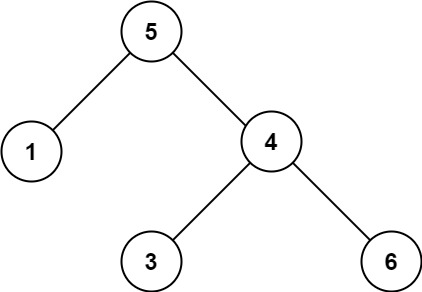

# 98.验证二叉搜索树

**难度：中等**

给你一个二叉树的根节点 `root` ，判断其是否是一个有效的二叉搜索树。

**有效** 二叉搜索树定义如下：

- 节点的左子树只包含 **小于** 当前节点的数。
- 节点的右子树只包含 **大于** 当前节点的数。
- 所有左子树和右子树自身必须也是二叉搜索树。

**示例 1：**


```
输入：root = [2,1,3]
输出：true
```

**示例 2：**



```
输入：root = [5,1,4,null,null,3,6]
输出：false
解释：根节点的值是 5 ，但是右子节点的值是 4 。
```

**提示：**

- 树中节点数目范围在`[1, 10^4]` 内
- `-2^31 <= Node.val <= 2^31 - 1`

## 递归法

二叉搜索树是一个有序树：

- 若它的左子树不空，则左子树上所有结点的值都小于它的根结点的值；
- 若它的右子树不空，则右子树上所有结点的值都大于它的根结点的值；
- 它的左、右子树也分别为二叉搜索树

这启示我们设计一个递归函数 `isValid(root, lower, upper)` 来递归判断，函数表示考虑以 `root` 为根的子树，判断子树中所有节点的值是否都在 `(l,r)`的范围内（注意是开区间）。如果 `root` 节点的值 `val` 不在 `(l,r)` 的范围内说明不满足条件直接返回，否则我们要继续递归调用检查它的左右子树是否满足，如果都满足才说明这是一棵二叉搜索树。

那么根据二叉搜索树的性质，在递归调用左子树时，我们需要把上界 `upper` 改为 `root.val`，即调用 `isValid(root.left, lower, root.val)`，因为左子树里所有节点的值均小于它的根节点的值。同理递归调用右子树时，我们需要把下界 `lower` 改为 `root.val`，即调用 `isValid(root.right, root.val, upper)`。

函数递归调用的入口为 `isValid(root, -inf, +inf)`， `inf` 表示一个无穷大的值。

算法步骤：

1. **递归的基本情况**：如果当前节点是`null`，根据二叉搜索树的定义，空树是有效的二叉搜索树，因此返回`true`。
2. **检查当前节点的值**：如果当前节点的值不满足二叉搜索树的性质（即，不在其允许的值范围`lower`和`upper`之间），则返回`false`。具体来说，当前节点的值必须大于其允许的最小值 `lower` 并且小于其允许的最大值 `upper`。
3. **递归检查左右子树**：
   - 对于左子树，其允许的值范围是 `lower` 到当前节点的值。递归调用 `isValid` 函数，将当前节点的值作为左子树允许的最大值。
   - 对于右子树，其允许的值范围是当前节点的值到 `upper`。递归调用 `isValid` 函数，将当前节点的值作为右子树允许的最小值。
4. **返回结果**：如果当前节点及其所有子树都满足二叉搜索树的性质，则返回 `true`。

## 代码展示

```java
public boolean isValidBST(TreeNode root) {
    return isValid(root, Long.MIN_VALUE, Long.MAX_VALUE);
}

public boolean isValid(TreeNode root, long lower, long upper) {
    if (root == null) {
        return true;
    }
    if (root.val <= lower || root.val >= upper) {
        return false;
    }
    return isValid(root.left, lower, root.val) && isValid(root.right, root.val, upper);
}
```

时间复杂度：O(n)，其中n是树中的节点数。算法需要访问树中的每个节点一次。

空间复杂度：O(h)，其中h是树的高度。递归调用栈的深度由树的高度决定。在最坏的情况下（树完全倾斜），空间复杂度可以达到O(n)。

**为什么使用 `long` 类型**：

使用 `long` 类型的 `Long.MIN_VALUE` 和 `Long.MAX_VALUE` 作为初始的上下界是为了包含 `int` 类型的所有可能值，因为二叉树节点的值是 `int` 类型的。这确保了在递归的最开始阶段，根节点的值不会因为边界问题而被错误地判断。

## 中序遍历+递归法

核心原理：**二叉搜索树是一个有序树，在中序遍历下其输出的是一个递增序列。**

这启示我们可以在中序遍历的时候，实时检查当前节点的值是否大于前一个中序遍历到的节点的值即可。如果一直大于，说明这个序列是升序的，整棵树是二叉搜索树，否则就不是。

算法步骤：

1. `prev` 变量用于记录中序遍历过程中访问的前一个节点。它在类的成员位置被初始化为`null`，以便在开始遍历时没有前一个节点。
2. `inorder` 方法实现了中序遍历。它首先递归地访问左子树，然后检查当前节点是否满足BST的条件（即当前节点的值应该大于`prev`节点的值），最后递归地访问右子树。
3. 如果在任何时候发现序列不是升序的，方法返回`false`。如果整个遍历过程中没有违反BST的条件，最终返回`true`。

## 代码展示

```java
TreeNode prev = null; // 用于记录中序遍历过程中的前一个节点

public boolean isValidBST(TreeNode root) {
    // 递归进行中序遍历，并检查序列是否升序
    return inorder(root);
}

public boolean inorder(TreeNode node) {
    if (node == null) {
        return true; // 空节点不违反BST的规则
    }

    // 首先递归检查左子树
    if (!inorder(node.left)) {// 如果左子树不是BST，则直接返回false
        return false;
    }

    // 检查当前节点的值是否大于前一个中序遍历到的节点的值
    if (prev != null && node.val <= prev.val) {
        return false; // 如果不是升序，说明不是BST
    }
    prev = node; // 更新prev为当前节点

    // 然后递归检查右子树
    return inorder(node.right);
}
```

时间复杂度：O(n)，其中n是树中的节点数。算法需要访问树中的每个节点恰好一次。

空间复杂度：O(h)，其中h是树的高度，对应递归调用栈的深度。在最坏的情况下（树完全倾斜），空间复杂度可以达到O(n)。

## 中序遍历+迭代法

上诉中的递归函数我们也可以用迭代的方式来实现，两种方式是等价的，区别在于递归的时候隐式地维护了一个栈，而我们在迭代的时候需要显式地将这个栈模拟出来，其他都相同，具体的代码思路如下：

1. **初始化**：创建一个栈来保存遍历过程中的节点，以及一个 `prev` 变量来记录上一次访问的节点。初始时，`prev` 设置为 `null`。
2. **迭代遍历**：使用 `current` 指针指向当前节点，初始时指向根节点 `root`。然后进入一个循环，直到 `current` 为 `null` 且栈为空。
3. **向左遍历**：在循环中，首先尽可能地向左遍历，并将沿途的节点压入栈中。这一步确保了能够按照中序遍历的顺序访问每个节点。
4. **处理节点**：当不能再向左遍历时，从栈中弹出一个节点进行处理。这个节点是当前中序遍历序列中的下一个节点。此时检查这个节点的值是否大于 `prev` 节点的值。如果不是（即当前节点的值小于等于 `prev` 节点的值），说明这不是一个有效的BST，返回 `false`。
5. **转向右子树**：处理完当前节点后，转向右子树并继续迭代过程。
6. **完成遍历**：当所有节点都被正确处理且没有发现违反BST性质的情况时，遍历结束，返回 `true`。

通过这种方法，算法首先访问最左侧的节点（最深的左子树），然后回到其父节点（根节点），最后处理右子树。这正好符合中序遍历的顺序（左-根-右）。使用栈来存储未来将要访问的节点，从而实现了迭代遍历，而不是使用递归。

## 代码展示

```java
public boolean isValidBST(TreeNode root) {
    TreeNode prev = null; // 用于记录中序遍历过程中的前一个节点
    Deque<TreeNode> stack = new LinkedList<>();
    TreeNode current = root;
    while (current != null || !stack.isEmpty()) {
        // 尽可能地向左遍历，并将沿途的节点压入栈
        while (current != null) {
            stack.push(current);
            current = current.left;
        }

        // 当到达最左侧节点后，弹出并处理节点
        current = stack.pop();
        if (prev != null && current.val <= prev.val) {
            return false;
        }
        prev = current;

        // 转向右子树
        current = current.right;
    }
    return true;
}
```

时间复杂度：O(n)，其中 n 是二叉树的节点数。每一个节点恰好被遍历一次。

空间复杂度：O(h)，其中h是树的高度。在最坏的情况下，栈中可能需要存储与树的高度相当数量的节点。对于一棵平衡二叉树，空间复杂度是O(log n)，而对于非平衡二叉树，最坏情况下的空间复杂度可能达到O(n)。

## 总结

二叉搜索树是一个有序树，在中序遍历下其输出的是一个递增序列。
